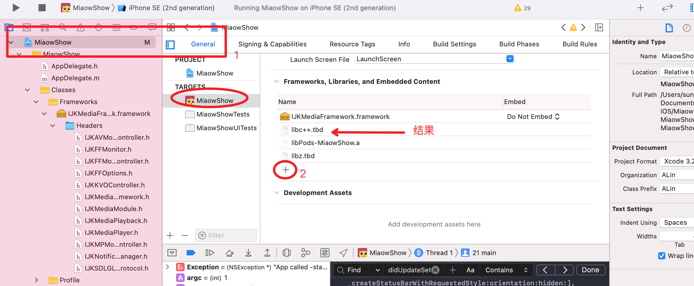
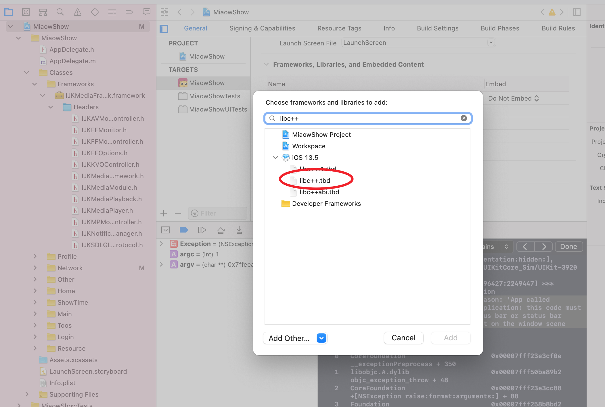
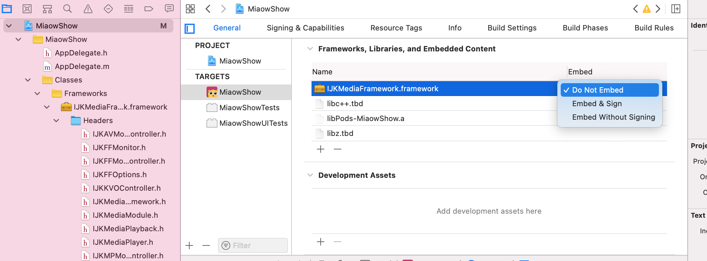

# framework方式导入Bilibi IJKPlayer相关问题解决

# 1 未定义符号
Undefined symbols for architecture x86_64

```
Undefined symbols for architecture x86_64:
  "operator delete(void*)", referenced from:
      _ijk_map_destroy in IJKMediaFramework(ijkstl.o)
      std::__1::__tree<std::__1::__value_type<long long, void*>, std::__1::__map_value_compare<long long, std::__1::__value_type<long long, void*>, std::__1::less<long long>, true>, std::__1::allocator<std::__1::__value_type<long long, void*> > >::erase(std::__1::__tree_const_iterator<std::__1::__value_type<long long, void*>, std::__1::__tree_node<std::__1::__value_type<long long, void*>, void*>*, long>) in IJKMediaFramework(ijkstl.o)
      std::__1::__tree<std::__1::__value_type<long long, void*>, std::__1::__map_value_compare<long long, std::__1::__value_type<long long, void*>, std::__1::less<long long>, true>, std::__1::allocator<std::__1::__value_type<long long, void*> > >::destroy(std::__1::__tree_node<std::__1::__value_type<long long, void*>, void*>*) in IJKMediaFramework(ijkstl.o)
  "operator new(unsigned long)", referenced from:
      _ijk_map_create in IJKMediaFramework(ijkstl.o)
      std::__1::pair<std::__1::__tree_iterator<std::__1::__value_type<long long, void*>, std::__1::__tree_node<std::__1::__value_type<long long, void*>, void*>*, long>, bool> std::__1::__tree<std::__1::__value_type<long long, void*>, std::__1::__map_value_compare<long long, std::__1::__value_type<long long, void*>, std::__1::less<long long>, true>, std::__1::allocator<std::__1::__value_type<long long, void*> > >::__emplace_unique_key_args<long long, std::__1::piecewise_construct_t const&, std::__1::tuple<long long const&>, std::__1::tuple<> >(long long const&, std::__1::piecewise_construct_t const&, std::__1::tuple<long long const&>&&, std::__1::tuple<>&&) in IJKMediaFramework(ijkstl.o)
ld: symbol(s) not found for architecture x86_64
clang: error: linker command failed with exit code 1 (use -v to see invocation)


Showing Recent Errors Only
Undefined symbol: operator delete(void*)
Undefined symbol: operator new(unsigned long)
```

## 问题定位
上述错误信息中，关键点IJKMediaFramework， delete(void*)，new(unsigned long) 可以推知是依赖的IJKMediaFramework的库中，引用了C++的操作符，但是本工程中未包含相应的C++ 库，进而导致报错。


## 解决方式
因为IJKPlayer的源码库中，使用了C++中的new(), delete 等操作符，故在集成改库的时候，需要导入必要的C++ 库。从本库中，增加libc++.tbd的项目库依赖。



# 2 签名报错
```
CodeSign /Users/sunjinglin/Library/Developer/Xcode/DerivedData/MiaowShow-dxsoosbjwiaxgrbbptzjcoztfwoo/Build/Products/Debug-iphonesimulator/MiaowShow.app/Frameworks/libstdc++.dylib (in target 'MiaowShow' from project 'MiaowShow')
    cd /Users/sunjinglin/Documents/Allcode/RTMP-iOS/MiaowShow/MiaowShow
    export CODESIGN_ALLOCATE=/Applications/Xcode.app/Contents/Developer/Toolchains/XcodeDefault.xctoolchain/usr/bin/codesign_allocate
    
Signing Identity:     "-"

    /usr/bin/codesign --force --sign - --timestamp=none --preserve-metadata=identifier,entitlements,flags /Users/sunjinglin/Library/Developer/Xcode/DerivedData/MiaowShow-dxsoosbjwiaxgrbbptzjcoztfwoo/Build/Products/Debug-iphonesimulator/MiaowShow.app/Frameworks/libstdc++.dylib

/Users/sunjinglin/Library/Developer/Xcode/DerivedData/MiaowShow-dxsoosbjwiaxgrbbptzjcoztfwoo/Build/Products/Debug-iphonesimulator/MiaowShow.app/Frameworks/libstdc++.dylib: No such file or directory
Command CodeSign failed with a nonzero exit code
```
## 问题定位
错误信息中，关键点/usr/bin/codesign libstdc++.dylib代码签名时出现问题（其实改错误信息，可以在工程里面搜索到的），很明显是针对"libstdc++.dylib"签名出现了问题，所以尝试去工程设置里面，找到有关签名的设置。


# 3 参考文献
## 1.[做直播项目中导入IJKPlayer时报错的一些解决方案: Showing Recent Messages "operator delete(void*)", referenced from:](https://my.oschina.net/jlongtian/blog/1551728)

## 2.[libstdc++.6.0.0.tbd or .dylib](https://stackoverflow.com/questions/36057291/libstdc-6-0-0-tbd-or-dylib)

## 4.[libstdc++适配Xcode10与iOS12](https://awhisper.github.io/2018/06/08/libstdc-inxcode10ios12/)